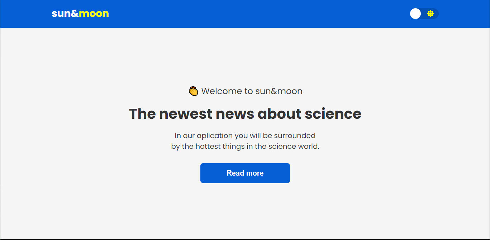

<h1 align="center"> sun-moon </h1>

  <a href="#-tecnologias">Tecnologias</a>&nbsp;&nbsp;&nbsp;|&nbsp;&nbsp;&nbsp;
  <a href="#-projeto">Projeto</a>&nbsp;&nbsp;&nbsp;|&nbsp;&nbsp;&nbsp;
  <a href="#memo-licença">Licença</a>

  

 

  

## 🚀 Tecnologias

Esse projeto foi desenvolvido com as seguintes tecnologias:

- ReactJS
- Styled Components

## 🔥 Algumas features neste projeto

- Switcher de temas com styled-components
- Estado do tema salvo no localStorage

## 💻 Projeto

- Sun&Moon é uma simples aplicação de troca de temas criado com React e Styled Components

## 📝 Licença

Esse projeto está sob a licença MIT.

---
